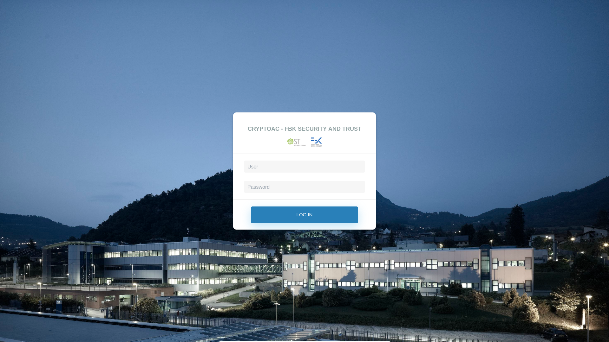
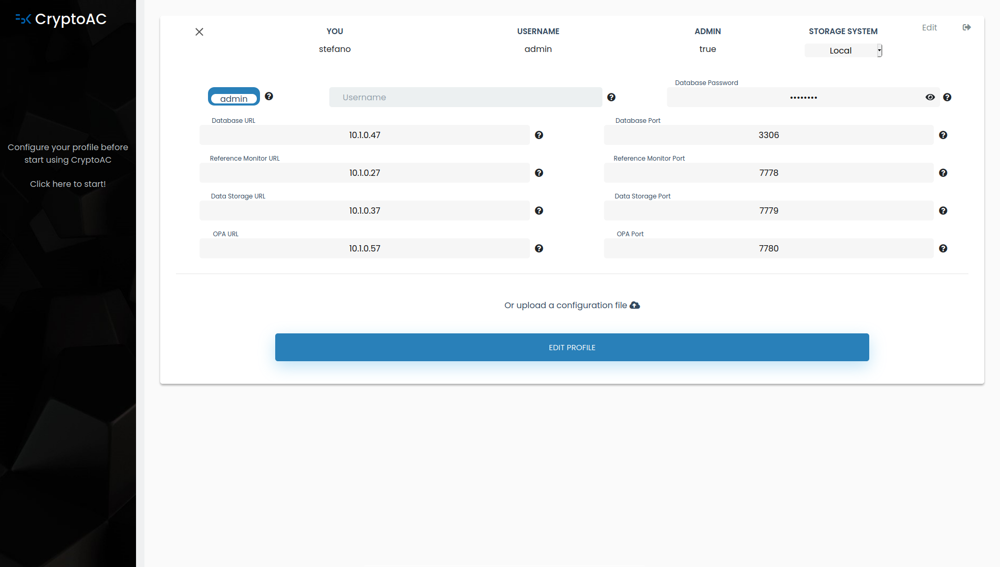
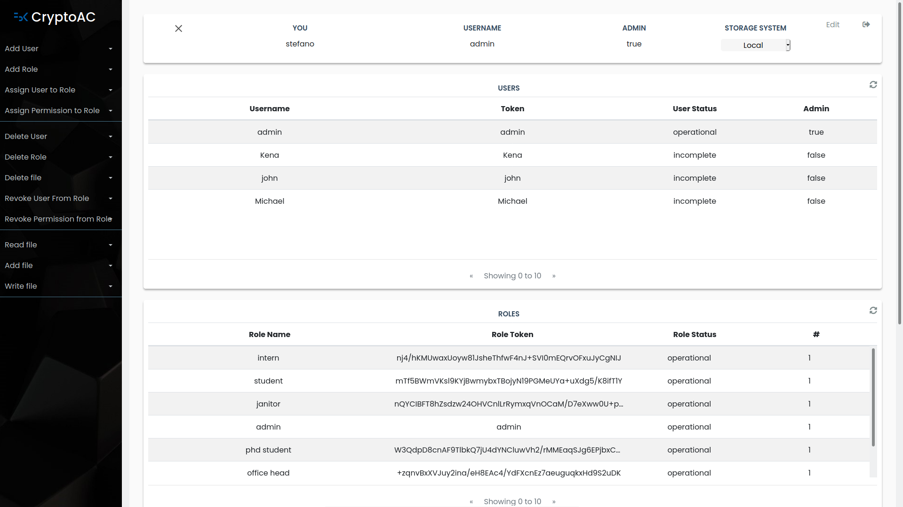

# CryptoAC | CryptoAC | Documentation | Proxy

> Last Update: 05/02/2020

## Introduction

The proxy is the module through which users access *CryptoAC* functionalities. The proxy offers a web app and RESTful APIs.

## Web App

The proxy allows users to login with traditional username-password credentials (currently, any password is valid). Single Sign-On (SSO) is an option that will be implemented. Once logged in, users have to configure their profile by choosing the proper Cloud Service Provider (CSP) through the "Select" item in the top-right corner. After having filled all fields, users have access to the dashboard. The black sidebar on the left presents the operations the user can perform, while the rest of the page contains the lists of users, roles and files.  

    
    
    

## RESTful APIs

The proxy uses the [**Spark Java framework**](https://sparkjava.com/) to setup a server and expose RESTful APIs returning JSON-formatted responses to guarantee maximum flexibility; see the [**documentation**](./CryptoACAPISwagger.yaml) for more information on the APIs.

**Security.** We followed the [**OWASP guidelines**](https://owasp.org/www-project-cheat-sheets/cheatsheets/Cross_Site_Scripting_Prevention_Cheat_Sheet#). to avoid web-based attacks (e.g., injection, Cross-Site Scripting). Moreover, all users' inputs are validated against OWASP-approved regular expressions. HTTPS is also enabled once the cryptographic certificate is provided.
 

## Proxy Core

As *CryptoAC* allows to enforce Role-Based Access Control (RBAC) policies, the proxy involves three elements:

* **users**: *CryptoAC* expects an administrator with full control over the access control policy. In particular, the administrator can create and delete users, roles and files. Moreover, the administrator can distribute and revoke permissions. Instead, normal users can only add, read and write files. We higlight that a single instance of the proxy can handle multiple users and that each user can have multiple configurations toward different CSPs. For each configuration, the proxy has a dedicated interface used to store and retrieve data from the underlying storage system;
* **roles**: roles are created internally in an organization for various job functions (e.g., doctor, student, dean, researcher). In RBAC, roles are used to group together privileges;
* **files**: the RBAC policy is enforced over files containing the actual sensitive or personal data. Each file is encrypted with a symmetric key. Both traditional and cryptographic RBAC policies can be enforced over files.

Each element in *CryptoAC* has an identifier (i.e., username, role name and file name) and a random token of 50 bytes for anonymity. Then, each user and role has a pair of asymmetric keys for encryption and decryption and another pair for signing and verifying signatures. Moreover, users and roles may be found in three different statuses:
* **incomplete**: the element was created but it is not fully configured (e.g., a user missing the keys);
* **operational**: the element is present, fully configured and is ready for use;
* **deleted**: the element was deleted.

Besides elements, CryptoAC features tuples to represent a link between two elements:

* **role tuples** - when a user is assigned to a role, a role tuple is created. A role tuple contains the identifiers of the user and the role and the role's asymmetric keys **encrypted** with the public key of the user;
* **permission tuples** - when a role is given a permission over a file, a permission tuple is created. A permission tuple contains the identifiers and the tokens of the role and the file, the given permission (i.e., either "read" or "read and write") and the symmetric key encrypted with the role's public key;
* **file tuples** - when a file is added, a file tuple is created. The file tuple contains information on the enforcement of cryptographic and traditional RBAC.

Each tuple is signed against accidental or malicious modifications.

## Data Access Object Pattern

The proxy employs the [**Data Access Object**](https://en.wikipedia.org/wiki/Data_access_object) (DAO) pattern to decouple the management of the policy from the actual storage of metadata and data. At high level, the DAO pattern expects an interface describing the functionalities needed to interact with the chosen underlying storage system. Currently, we provide two implementations of the DAO interface, one (not supported) toward the Amazon Web Services (see [**the documentation**](../../CryptoAC-AWSLambda)) and one following the microservices paradigm.

The second implementation expects the [**Metadata Storage**](../MS) to be a MySQL8+ database and the [**Data Storage**](../DS) to be a module provided by *CryptoAC*. See the related documentations for details. 

We highlight that it is possible to provide another implementation of the DAO interface to integrate *CryptoAC* with other services (e.g., as a plugin for a text editor or for integration with Hyperledger Fabric).