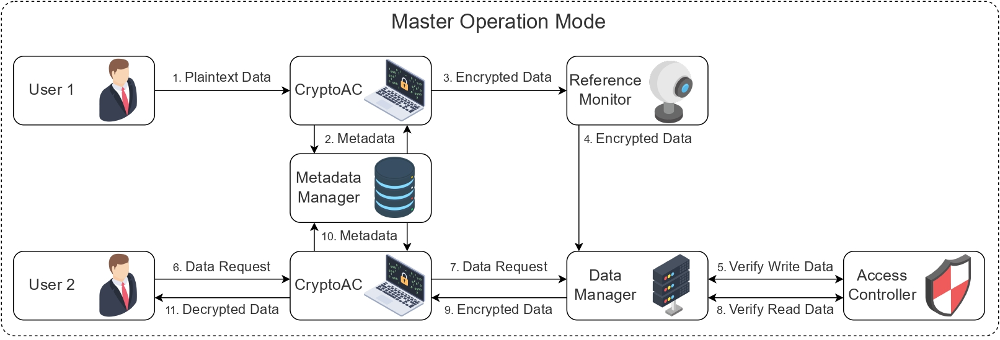
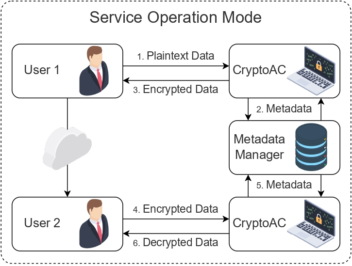

.. role:: bash(code)
   :language: bash

************
Architecture
************

CryptoAC provides flexible and portable enforcement of access control policies through cryptography in a wide variety of scenarios. For this reason, **the architecture**--intended as which :ref:`modules <CryptoAC Modules>` are used--and the consequent deployment of CryptoAC, as well as the interaction with other entities (e.g., a MySQL database, a Cloud simple storage service, an MQTT broker), **changes according to the chosen configuration and the underlying scenario**. Anyway, at high-level, CryptoAC can run in two main operation modes: :ref:`Master <Master Operation Mode>` and :ref:`Service <Service Operation Mode>` [1]_. 

Master Operation Mode
#####################

When used in Master mode, CryptoAC assumes a **pivotal role** in the management of the cryptographic access control policy, the related metadata and the involved resources by interacting with other entities directly. In other words, the application is built around CryptoAC, which acts at a gateway for the whole architecture.

To illustrate the functioning of CryptoAC when running in Master mode, consider the following example: assume a user has some sensitive data that she wants to share with another user securely. In this case, the user sends the data to an instance of CryptoAC, either located on the same device (e.g., laptop, smartphone) or deployed as a server (step 1 in the diagram below) operated by a trusted agent. Consequently, this instance of CryptoAC encrypts the data--generating the corresponding metadata--according to the cryptographic access control policy previously defined by the administrator of the application. The instance of CryptoAC then publishes the metadata to a :ref:`Metadata Manager <Metadata Manager>` (step 2) and the encrypted data to a :ref:`Reference Monitor <Reference Monitor>` (step 3). After having confirmed the correctness and the compliance of the user's operation with the policy, the Reference Monitor sends the encrypted data to a :ref:`Data Manager <Data Manager>` (step 4), which double-checks the user's operation with an :ref:`Access Controller <Access Controller>` (step 5). An authorized user can download the data by sending a request to another--or even the same--instance of CryptoAC (step 6), which retrieves the encrypted data from the Data Manager when approved by the Access Controller (steps 7--9). Finally, the instance of CryptoAC acquires the required metadata (step 10) and returns the decrypted data to the user (step 11).

.. note::
   The :ref:`Access Controller <Access Controller>` is an optional module used to relieve the computational burden of cryptography according to the sensitivity and trust of involved data and users.

Service Operation mode
######################

Intuitively, it is not always possible to design a whole application around CryptoAC because, e.g., such an application may already be up and running or have a traditional access control enforcement mechanism  alreadyin place. For this reason, CryptoAC has the capability to **integrate with existing application easily** and with minimal disruption by running in the Service mode. In other words, CryptoAC can function as a (micro)service which simply manages the distribution of cryptographic keys and en/decrypts data according to the policy, synchronizing different instances on the same :ref:`Metadata Manager <Metadata Manager>`. Then, it is up to the users and the application to manage (e.g., share, store, version) the data.

The functioning of CryptoAC when running in Service mode is similar to the :ref:`Master <Master Operation Mode>`, with the following exceptions:

* CryptoAC returns en/decrypted data to the invoking users.

* Besides CryptoAC, the only other module required is the :ref:`Metadata Manager <Metadata Manager>`.

.. note::
   Support of CryptoAC for the Service operation mode is currently under development.

.. [1] `Icons in images were created by vectorsmarket15 - Flaticon <https://www.flaticon.com/authors/vectorsmarket15>`_.
