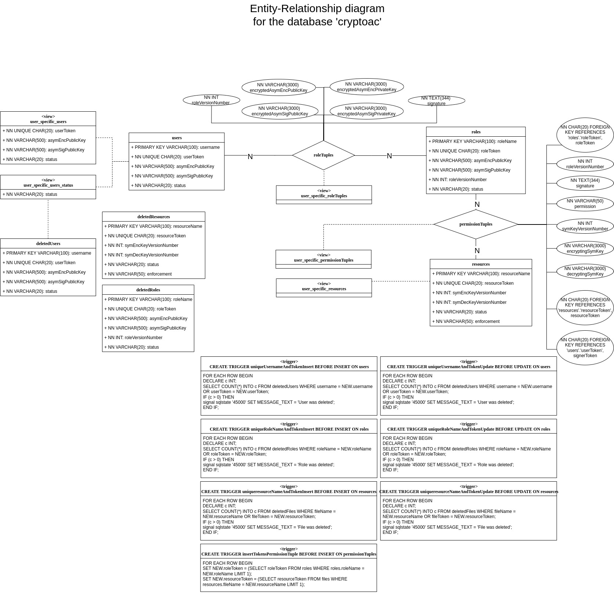
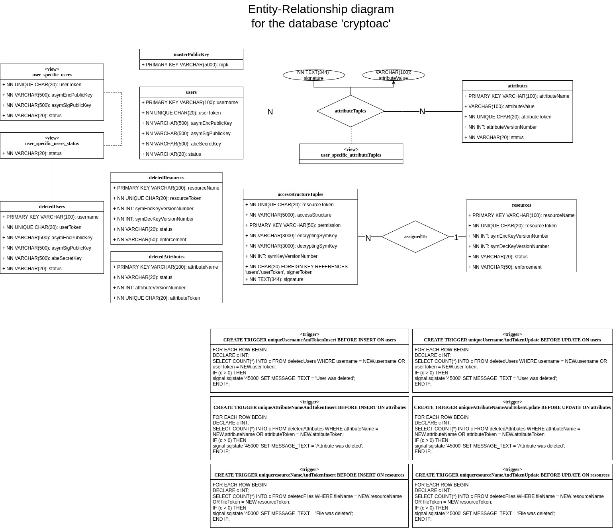

.. role:: bash(code)
   :language: bash

*****
MySQL
*****

`MySQL <https://www.mysql.com/en/>`_ is an open-source (GPL licensed) relational database management system, where data are organized into one or more tables possibly related to each other according to a given structure.

.. note::
   CryptoAC integrates with MySQL (v8.0+) for both RBAC and ABAC policies.

Role-based Access Control Integration with MySQL
################################################

CryptoAC stores the metadata related to the status of the role-based cryptographic access control policy in a MySQL v8.0+ database with default name :bash:`cryptoac`. The administrator signs all metadata to guarantee their integrity.

We assign pseudonyms--random sequences of bytes--to users, roles and resources to hide (potentially sensitive) identifiers. Moreover, to avoid the disclosure of the whole cryptographic access control policy to the users in compliance with the **need-to-know** principle, we limit users' query privileges by employing views and row-level permissions. In this way, each user knows her portion of the policy only.

To avoid stored-XSS attacks, all database inputs and outputs are sanitized through the :bash:`PreparedStatement` Java class and the `OWASP Java Encoder <https://owasp.org/www-project-java-encoder/>`_, respectively. All encrypted values are converted in :bash:`base64` before being stored in the database. Finally, users' access to the database is protected by passwords.

Role-based Access Control Configuration for MySQL
*************************************************

To interact with the MySQL database, CryptoAC needs to know the endpoint (i.e., the URL and the port) on which the database is listening to connections and the client's username and password; see the :ref:`Core Profiles <Core Profiles>` section for more details. Whenever the administrator adds a user to the policy, CryptoAC also creates the user's account in the MySQL database and generates the user's password. Intuitively, the database should have already been configured with an account for the administrator by using the initialization :bash:`sql` script below:

.. code-block:: sql

    /** 
     * What follows is related to the administrator of CryptoAC, and not to 
     * the administrator of the database (which may be a separate user). Also, 
     * remember to select a suitable password for the administrator of CryptoAC
     * and change the one below (i.e., `password`). Please leave the rest untouched.
     */
    DROP USER IF EXISTS 'admin'@'%';
    CREATE USER 'admin'@'%' IDENTIFIED BY 'password';
    GRANT SELECT,INSERT,UPDATE,DELETE ON *.* TO 'admin'@'%' WITH GRANT OPTION;
    GRANT REFERENCES ON *.* TO 'admin'@'%';
    GRANT CREATE USER ON *.* TO 'admin'@'%';
    GRANT CREATE VIEW ON *.* TO 'admin'@'%';
    GRANT TRIGGER ON *.* TO 'admin'@'%';
    GRANT CREATE ON *.* TO 'admin'@'%';
    GRANT DROP ON *.* TO 'admin'@'%';
    GRANT DELETE ON *.* TO 'admin'@'%';
    GRANT SYSTEM_VARIABLES_ADMIN ON *.* TO 'admin'@'%';
    FLUSH PRIVILEGES;

Then, at start-up, CryptoAC configures the database by creating the necessary tables, views and triggers, as shown in the graph below.

.. collapse:: Expand this to see the :bash:`sql` script corresponding to the graph above:

    .. code-block:: sql

        /* (drop if exists) create and set new schema */
        DROP SCHEMA IF EXISTS `cryptoac`;
        CREATE SCHEMA `cryptoac`;
        USE `cryptoac`;

        /* to enable triggers in the database */
        SET GLOBAL log_bin_trust_function_creators = 1;

        /* remember that MySQL automatically creates indexes for primary keys and unique fields */

        /* re-create tables */
        CREATE TABLE `users` (
        `username` varchar(100),
        `userToken` char(20) NOT NULL UNIQUE,
        `asymEncPublicKey` varchar(500) NOT NULL,
        `asymSigPublicKey` varchar(500) NOT NULL,
        `status` varchar(20) NOT NULL,
        PRIMARY KEY (`username`)
        ) ENGINE=InnoDB DEFAULT CHARSET=utf8mb4 COLLATE=utf8mb4_0900_ai_ci;

        CREATE TABLE `deletedUsers` (
        `username` varchar(100),
        `userToken` char(20) NOT NULL UNIQUE,
        `asymEncPublicKey` varchar(500) NOT NULL,
        `asymSigPublicKey` varchar(500) NOT NULL,
        `status` varchar(20) NOT NULL,
        PRIMARY KEY (`username`)
        ) ENGINE=InnoDB DEFAULT CHARSET=utf8mb4 COLLATE=utf8mb4_0900_ai_ci;

        CREATE TABLE `roles` (
        `roleName` varchar(100),
        `roleToken` char(20) NOT NULL UNIQUE,
        `asymEncPublicKey` varchar(500) NOT NULL,
        `asymSigPublicKey` varchar(500) NOT NULL,
        `roleVersionNumber` int NOT NULL,
        `status` varchar(20) NOT NULL,
        PRIMARY KEY (`roleName`)
        ) ENGINE=InnoDB DEFAULT CHARSET=utf8mb4 COLLATE=utf8mb4_0900_ai_ci;

        CREATE TABLE `deletedRoles` (
        `roleName` varchar(100),
        `roleToken` char(20) NOT NULL UNIQUE,
        `asymEncPublicKey` varchar(500) NOT NULL,
        `asymSigPublicKey` varchar(500) NOT NULL,
        `roleVersionNumber` int NOT NULL,
        `status` varchar(20) NOT NULL,
        PRIMARY KEY (`roleName`)
        ) ENGINE=InnoDB DEFAULT CHARSET=utf8mb4 COLLATE=utf8mb4_0900_ai_ci;

        CREATE TABLE `resources` (
        `resourceName` varchar(100),
        `resourceToken` char(20) NOT NULL UNIQUE,
        `symEncKeyVersionNumber` int NOT NULL,
        `symDecKeyVersionNumber` int NOT NULL,
        `status` varchar(20) NOT NULL,
        `enforcement` varchar(50) NOT NULL,
        PRIMARY KEY (`resourceName`)
        ) ENGINE=InnoDB DEFAULT CHARSET=utf8mb4 COLLATE=utf8mb4_0900_ai_ci;

        CREATE TABLE `deletedResources` (
        `resourceName` varchar(100),
        `resourceToken` char(20) NOT NULL UNIQUE,
        `symEncKeyVersionNumber` int NOT NULL,
        `symDecKeyVersionNumber` int NOT NULL,
        `status` varchar(20) NOT NULL,
        `enforcement` varchar(50) NOT NULL,
        PRIMARY KEY (`resourceName`)
        ) ENGINE=InnoDB DEFAULT CHARSET=utf8mb4 COLLATE=utf8mb4_0900_ai_ci;

        CREATE TABLE `roleTuples` (
        `username` varchar(100),
        `roleName` varchar(100),
        `encryptedAsymEncPublicKey` varchar(3000) NOT NULL,
        `encryptedAsymEncPrivateKey` varchar(3000) NOT NULL,
        `encryptedAsymSigPublicKey` varchar(3000) NOT NULL,
        `encryptedAsymSigPrivateKey` varchar(3000) NOT NULL,
        `roleVersionNumber` int NOT NULL,
        `signature` text(344) NOT NULL,
        PRIMARY KEY (`username`,`roleName`),
        KEY `fk_roleTuples_username_idx` (`username`),
        KEY `fk_roleTuples_roleName_idx` (`roleName`),
        CONSTRAINT `fk_roleTuples_username` FOREIGN KEY (`username`) REFERENCES `users` (`username`),
        CONSTRAINT `fk_roleTuples_roleName` FOREIGN KEY (`roleName`) REFERENCES `roles` (`roleName`)
        ) ENGINE=InnoDB DEFAULT CHARSET=utf8mb4 COLLATE=utf8mb4_0900_ai_ci;

        CREATE TABLE `permissionTuples` (
        `roleName` varchar(100),
        `resourceName` varchar(100),
        `roleToken` char(20),
        `resourceToken` char(20),
        `encryptingSymKey` varchar(3000) NOT NULL,
        `decryptingSymKey` varchar(3000) NOT NULL,
        `symKeyVersionNumber` int NOT NULL,
        `roleVersionNumber` int NOT NULL,
        `permission` varchar(50) NOT NULL,
        `signerToken` char(20) NOT NULL,
        `signature` text(344) NOT NULL,
        PRIMARY KEY (`roleName`,`resourceName`),
        KEY `fk_permissionTuples_roleName_idx` (`roleName`),
        KEY `fk_permissionTuples_resourceName_idx` (`resourceName`),
        KEY `fk_permissionTuples_roleToken_idx` (`roleToken`),
        KEY `fk_permissionTuples_resourceToken_idx` (`resourceToken`),
        KEY `fk_permissionTuples_signerToken_idx` (`signerToken`),
        CONSTRAINT `fk_permissionTuples_roleName`  FOREIGN KEY (`roleName`)  REFERENCES `roles` (`roleName`),
        CONSTRAINT `fk_permissionTuples_resourceName`  FOREIGN KEY (`resourceName`)  REFERENCES `resources` (`resourceName`),
        CONSTRAINT `fk_permissionTuples_roleToken` FOREIGN KEY (`roleToken`) REFERENCES `roles` (`roleToken`) ON UPDATE CASCADE,
        CONSTRAINT `fk_permissionTuples_resourceToken` FOREIGN KEY (`resourceToken`) REFERENCES `resources` (`resourceToken`) ON UPDATE CASCADE,
        CONSTRAINT `fk_permissionTuples_signerToken` FOREIGN KEY (`signerToken`) REFERENCES `users` (`userToken`) ON UPDATE CASCADE
        ) ENGINE=InnoDB DEFAULT CHARSET=utf8mb4 COLLATE=utf8mb4_0900_ai_ci;

        /* note how users can modify ONLY their public key and ONLY once */
        CREATE VIEW `user_specific_users` (`asymEncPublicKey`, `asymSigPublicKey`,  `userToken`, `status`) AS
            SELECT
                `users`.`asymEncPublicKey` AS `asymEncPublicKey`,
                `users`.`asymSigPublicKey` AS `asymSigPublicKey`,
                `users`.`userToken` AS `userToken`,
                `users`.`status` AS `status`
            FROM
                `users`
            WHERE
                `users`.`username` = (CONVERT( SUBSTRING_INDEX(USER(), '@', 1) USING UTF8MB4)) AND
                `users`.`asymEncPublicKey` = 'mock' AND
                `users`.`asymSigPublicKey` = 'mock';

        /* this view allows users to check their status */
        CREATE VIEW `user_specific_users_status` (`status`) AS
            (
                SELECT
                    `users`.`status` AS `status`
                FROM
                    `users`
                WHERE
                    `users`.`username` = (CONVERT( SUBSTRING_INDEX(USER(), '@', 1) USING UTF8MB4))
            )
            UNION
            (
                SELECT
                    `deletedUsers`.`status` AS `status`
                FROM
                    `deletedUsers`
                WHERE
                    `deletedUsers`.`username` = (CONVERT( SUBSTRING_INDEX(USER(), '@', 1) USING UTF8MB4))
            );

        /* users can access only their role tuples */
        CREATE VIEW `user_specific_roleTuples`
        (`username`, `roleName`, `roleVersionNumber`, `encryptedAsymEncPublicKey`,
        `encryptedAsymEncPrivateKey`, `encryptedAsymSigPublicKey`,
        `encryptedAsymSigPrivateKey`, `signature`) AS
            SELECT
                `roleTuples`.`username` AS `username`,
                `roleTuples`.`roleName` AS `roleName`,
                `roleTuples`.`roleVersionNumber` AS `roleVersionNumber`,
                `roleTuples`.`encryptedAsymEncPublicKey` AS `encryptedAsymEncPublicKey`,
                `roleTuples`.`encryptedAsymEncPrivateKey` AS `encryptedAsymEncPrivateKey`,
                `roleTuples`.`encryptedAsymSigPublicKey` AS `encryptedAsymSigPublicKey`,
                `roleTuples`.`encryptedAsymSigPrivateKey` AS `encryptedAsymSigPrivateKey`,
                `roleTuples`.`signature` AS `signature`
            FROM
                `roleTuples`
            WHERE
                `roleTuples`.`username` = (CONVERT( SUBSTRING_INDEX(USER(), '@', 1) USING UTF8MB4));

        /* users can access only the permissions they have */
        CREATE VIEW `user_specific_permissionTuples`
        (`roleName`, `resourceName`, `roleToken`, `resourceToken`, `encryptingSymKey`, `decryptingSymKey`,
        `symKeyVersionNumber`, `roleVersionNumber`, `permission`, `signerToken`, `signature`) AS
            SELECT
                `permissionTuples`.`roleName` AS `roleName`,
                `permissionTuples`.`resourceName` AS `resourceName`,
                `permissionTuples`.`roleToken` AS `roleToken`,
                `permissionTuples`.`resourceToken` AS `resourceToken`,
                `permissionTuples`.`encryptingSymKey` AS `encryptingSymKey`,
                `permissionTuples`.`decryptingSymKey` AS `decryptingSymKey`,
                `permissionTuples`.`symKeyVersionNumber` AS `symKeyVersionNumber`,
                `permissionTuples`.`roleVersionNumber` AS `roleVersionNumber`,
                `permissionTuples`.`permission` AS `permission`,
                `permissionTuples`.`signerToken` AS `signerToken`,
                `permissionTuples`.`signature` AS `signature`
            FROM
                `permissionTuples`
            WHERE
                `permissionTuples`.`roleName` IN (SELECT `user_specific_roleTuples`.`roleName` FROM `user_specific_roleTuples`);

        /* users can access only the resources they have permission over */
        CREATE VIEW `user_specific_resources`
        (`resourceName`, `resourceToken`, `symEncKeyVersionNumber`, `symDecKeyVersionNumber`, `status`, `enforcement`) AS
            SELECT
                `resources`.`resourceName` AS `resourceName`,
                `resources`.`resourceToken` AS `resourceToken`,
                `resources`.`symEncKeyVersionNumber` AS `symEncKeyVersionNumber`,
                `resources`.`symDecKeyVersionNumber` AS `symDecKeyVersionNumber`,
                `resources`.`status` AS `status`,
                `resources`.`enforcement` AS `enforcement`
            FROM
                `resources`
            WHERE
                `resources`.`resourceName` IN (SELECT `user_specific_permissionTuples`.`resourceName` FROM `user_specific_permissionTuples`);

        /* Avoid new users with same name as deleted ones */
        DELIMITER //
        CREATE TRIGGER uniqueUsernameAndTokenInsert BEFORE INSERT ON users
        FOR EACH ROW BEGIN
        DECLARE c INT;
        SELECT COUNT(*) INTO c FROM deletedUsers WHERE username = NEW.username OR userToken = NEW.userToken;
        IF (c > 0) THEN
        signal sqlstate '45000' SET MESSAGE_TEXT = 'User was deleted';
        END IF;
        END //

        DELIMITER //
        CREATE TRIGGER uniqueUsernameAndTokenUpdate BEFORE UPDATE ON users
        FOR EACH ROW BEGIN
        DECLARE c INT;
        SELECT COUNT(*) INTO c FROM deletedUsers WHERE username = NEW.username OR userToken = NEW.userToken;
        IF (c > 0) THEN
        signal sqlstate '45000' SET MESSAGE_TEXT = 'User was deleted';
        END IF;
        END //

        /* Avoid new roles with same name as deleted ones */
        DELIMITER //
        CREATE TRIGGER uniqueRoleNameAndTokenInsert BEFORE INSERT ON roles
        FOR EACH ROW BEGIN
        DECLARE c INT;
        SELECT COUNT(*) INTO c FROM deletedRoles WHERE roleName = NEW.roleName OR roleToken = NEW.roleToken;
        IF (c > 0) THEN
        signal sqlstate '45000' SET MESSAGE_TEXT = 'Role was deleted';
        END IF;
        END //

        DELIMITER //
        CREATE TRIGGER uniqueRoleNameAndTokenUpdate BEFORE UPDATE ON roles
        FOR EACH ROW BEGIN
        DECLARE c INT;
        SELECT COUNT(*) INTO c FROM deletedRoles WHERE roleName = NEW.roleName OR roleToken = NEW.roleToken;
        IF (c > 0) THEN
        signal sqlstate '45000' SET MESSAGE_TEXT = 'Role was deleted';
        END IF;
        END //

        /* Avoid new resources with same name as deleted ones */
        DELIMITER //
        CREATE TRIGGER uniqueResourceNameAndTokenInsert BEFORE INSERT ON resources
        FOR EACH ROW BEGIN
        DECLARE c INT;
        SELECT COUNT(*) INTO c FROM deletedResources WHERE resourceName = NEW.resourceName OR resourceToken = NEW.resourceToken;
        IF (c > 0) THEN
        signal sqlstate '45000' SET MESSAGE_TEXT = 'Resource was deleted';
        END IF;
        END //

        DELIMITER //
        CREATE TRIGGER uniqueResourceNameAndTokenUpdate BEFORE UPDATE ON resources
        FOR EACH ROW BEGIN
        DECLARE c INT;
        SELECT COUNT(*) INTO c FROM deletedResources WHERE resourceName = NEW.resourceName OR resourceToken = NEW.resourceToken;
        IF (c > 0) THEN
        signal sqlstate '45000' SET MESSAGE_TEXT = 'Resource was deleted';
        END IF;
        END //

.. warning::
   The `secure deployment of MySQL <https://dev.mysql.com/doc/mysql-secure-deployment-guide/8.0/en/secure-deployment-overview.html>`_ is currently under development.

Attribute-based Access Control Integration with MySQL
#####################################################

CryptoAC stores the metadata related to the status of the attribute-based cryptographic access control policy in a MySQL v8.0+ database with default name :bash:`cryptoac`. The administrator signs all metadata to guarantee their integrity.

To avoid the disclosure of the whole cryptographic access control policy to the users in compliance with the **need-to-know** principle, we limit users' query privileges by employing views and row-level permissions. In this way, each user knows her portion of the policy only. Moreover, we assign pseudonyms--random sequences of bytes--to users, attributes and resources to hide (potentially sensitive) identifiers.

To avoid stored-XSS attacks, all database inputs and outputs are sanitized through the :bash:`PreparedStatement` Java class and the `OWASP Java Encoder <https://owasp.org/www-project-java-encoder/>`_, respectively. All encrypted values are converted in :bash:`base64` before being stored in the database. Finally, users' access to the database is protected by passwords.

Attribute-based Access Control Configuration for MySQL
******************************************************

To interact with the MySQL database, CryptoAC needs to know the endpoint (i.e., the URL and the port) on which the database is listening to connections and the client's username and password; see the :ref:`Core Profiles <Core Profiles>` section for more details. Whenever the administrator adds a user to the policy, CryptoAC also creates the user's account in the MySQL database and generates the user's password. Intuitively, the database should have already been configured with an account for the administrator by using the initialization :bash:`sql` script below:

.. code-block:: sql

    /** 
     * What follows is related to the administrator of CryptoAC, and not to 
     * the administrator of the database (which may be a separate user). Also, 
     * remember to select a suitable password for the administrator of CryptoAC
     * and change the one below (i.e., `password`). Please leave the rest untouched.
     */
    DROP USER IF EXISTS 'admin'@'%';
    CREATE USER 'admin'@'%' IDENTIFIED BY 'password';
    GRANT SELECT,INSERT,UPDATE,DELETE ON *.* TO 'admin'@'%' WITH GRANT OPTION;
    GRANT REFERENCES ON *.* TO 'admin'@'%';
    GRANT CREATE USER ON *.* TO 'admin'@'%';
    GRANT CREATE VIEW ON *.* TO 'admin'@'%';
    GRANT TRIGGER ON *.* TO 'admin'@'%';
    GRANT CREATE ON *.* TO 'admin'@'%';
    GRANT DROP ON *.* TO 'admin'@'%';
    GRANT DELETE ON *.* TO 'admin'@'%';
    GRANT SYSTEM_VARIABLES_ADMIN ON *.* TO 'admin'@'%';
    FLUSH PRIVILEGES;

Then, at start-up, CryptoAC configures the database by creating the necessary tables, views and triggers, as shown in the graph below.

.. collapse:: Expand this to see the :bash:`sql` script corresponding to the graph above: 

    .. code-block:: sql

        /* (drop if exists) create and set new schema */
        DROP SCHEMA IF EXISTS `cryptoac`;
        CREATE SCHEMA `cryptoac`;
        USE `cryptoac`;

        /* to enable triggers in the database */
        SET GLOBAL log_bin_trust_function_creators = 1;

        /* remember that MySQL automatically creates indexes for primary keys and unique fields */

        /* re-create tables */
        /* The ENUM construct as primary key is used to prevent that more than one row can be entered to the table */
        CREATE TABLE `masterPublicKey` (
        `id` enum('1') NOT NULL,
        `mpk` varchar(5000),
        PRIMARY KEY (`id`)
        ) ENGINE=InnoDB DEFAULT CHARSET=utf8mb4 COLLATE=utf8mb4_0900_ai_ci;

        CREATE TABLE `users` (
        `username` varchar(100),
        `userToken` char(20) NOT NULL UNIQUE,
        `asymEncPublicKey` varchar(500) NOT NULL,
        `asymSigPublicKey` varchar(500) NOT NULL,
        `abeSecretKey` text,
        `status` varchar(20) NOT NULL,
        PRIMARY KEY (`username`)
        ) ENGINE=InnoDB DEFAULT CHARSET=utf8mb4 COLLATE=utf8mb4_0900_ai_ci;

        CREATE TABLE `deletedUsers` (
        `username` varchar(100),
        `userToken` char(20) NOT NULL UNIQUE,
        `asymEncPublicKey` varchar(500) NOT NULL,
        `asymSigPublicKey` varchar(500) NOT NULL,
        `abeSecretKey` text NOT NULL,
        `status` varchar(20) NOT NULL,
        PRIMARY KEY (`username`)
        ) ENGINE=InnoDB DEFAULT CHARSET=utf8mb4 COLLATE=utf8mb4_0900_ai_ci;

        CREATE TABLE `attributes` (
        `attributeName` varchar(100),
        `attributeToken` char(20) NOT NULL UNIQUE,
        `attributeVersionNumber` int NOT NULL,
        `status` varchar(20) NOT NULL,
        PRIMARY KEY (`attributeName`)
        ) ENGINE=InnoDB DEFAULT CHARSET=utf8mb4 COLLATE=utf8mb4_0900_ai_ci;

        CREATE TABLE `deletedAttributes` (
        `attributeName` varchar(100),
        `attributeToken` char(20) NOT NULL UNIQUE,
        `attributeVersionNumber` int NOT NULL,
        `status` varchar(20) NOT NULL,
        PRIMARY KEY (`attributeName`)
        ) ENGINE=InnoDB DEFAULT CHARSET=utf8mb4 COLLATE=utf8mb4_0900_ai_ci;

        CREATE TABLE `resources` (
        `resourceName` varchar(100),
        `resourceToken` char(20) NOT NULL UNIQUE,
        `symEncKeyVersionNumber` int NOT NULL,
        `symDecKeyVersionNumber` int NOT NULL,
        `status` varchar(20) NOT NULL,
        `enforcement` varchar(50) NOT NULL,
        PRIMARY KEY (`resourceName`)
        ) ENGINE=InnoDB DEFAULT CHARSET=utf8mb4 COLLATE=utf8mb4_0900_ai_ci;

        CREATE TABLE `deletedResources` (
        `resourceName` varchar(100),
        `resourceToken` char(20) NOT NULL UNIQUE,
        `symEncKeyVersionNumber` int NOT NULL,
        `symDecKeyVersionNumber` int NOT NULL,
        `status` varchar(20) NOT NULL,
        `enforcement` varchar(50) NOT NULL,
        PRIMARY KEY (`resourceName`)
        ) ENGINE=InnoDB DEFAULT CHARSET=utf8mb4 COLLATE=utf8mb4_0900_ai_ci;

        CREATE TABLE `attributeTuples` (
        `username` varchar(100),
        `attributeName` varchar(100),
        `attributeValue` varchar(100),
        `signature` text(344) NOT NULL,
        PRIMARY KEY (`username`,`attributeName`),
        KEY `fk_attributeTuples_username_idx` (`username`),
        KEY `fk_attributeTuples_attributeName_idx` (`attributeName`),
        CONSTRAINT `fk_attributeTuples_username` FOREIGN KEY (`username`) REFERENCES `users` (`username`),
        CONSTRAINT `fk_attributeTuples_attributeName` FOREIGN KEY (`attributeName`) REFERENCES `attributes` (`attributeName`)
        ) ENGINE=InnoDB DEFAULT CHARSET=utf8mb4 COLLATE=utf8mb4_0900_ai_ci;

        CREATE TABLE `accessStructureTuples` (
        `resourceName` varchar(100),
        `resourceToken` char(20) NOT NULL,
        `accessStructure` varchar(5000) NOT NULL,
        `permission` varchar(50) NOT NULL,
        `encryptingSymKey` varchar(3000) NOT NULL,
        `decryptingSymKey` varchar(3000) NOT NULL,
        `symKeyVersionNumber` int NOT NULL,
        `signerToken` char(20) NOT NULL,
        `signature` text(344) NOT NULL,
        PRIMARY KEY (`resourceName`,`permission`),
        KEY `fk_accessStructureTuples_resourceName_idx` (`resourceName`),
        KEY `fk_accessStructureTuples_resourceToken_idx` (`resourceToken`),
        KEY `fk_accessStructureTuples_signerToken_idx` (`signerToken`),
        CONSTRAINT `fk_accessStructureTuples_resourceName` FOREIGN KEY (`resourceName`) REFERENCES `resources` (`resourceName`),
        CONSTRAINT `fk_accessStructureTuples_resourceToken` FOREIGN KEY (`resourceToken`) REFERENCES `resources` (`resourceToken`) ON UPDATE CASCADE,
        CONSTRAINT `fk_accessStructureTuples_signerToken` FOREIGN KEY (`signerToken`) REFERENCES `users` (`userToken`) ON UPDATE CASCADE
        ) ENGINE=InnoDB DEFAULT CHARSET=utf8mb4 COLLATE=utf8mb4_0900_ai_ci;

        /* note how users can modify ONLY their public key and ONLY once */
        CREATE VIEW `user_specific_users` (`asymEncPublicKey`, `asymSigPublicKey`,  `userToken`, `status`) AS
            SELECT
                `users`.`asymEncPublicKey` AS `asymEncPublicKey`,
                `users`.`asymSigPublicKey` AS `asymSigPublicKey`,
                `users`.`userToken` AS `userToken`,
                `users`.`status` AS `status`
            FROM
                `users`
            WHERE
                `users`.`username` = (CONVERT( SUBSTRING_INDEX(USER(), '@', 1) USING UTF8MB4)) AND
                `users`.`asymEncPublicKey` = 'mock' AND
                `users`.`asymSigPublicKey` = 'mock';

        /* this view allows users to check their status and get their ABE key */
        CREATE VIEW `user_specific_users_info` (`username`, `status`, `abeSecretKey`) AS
            (
                SELECT
                    `users`.`username` AS `username`,
                    `users`.`status` AS `status`,
                    `users`.`abeSecretKey` AS `abeSecretKey`
                FROM
                    `users`
                WHERE
                    `users`.`username` = (CONVERT( SUBSTRING_INDEX(USER(), '@', 1) USING UTF8MB4))
            )
            UNION
            (
                SELECT
                    `deletedUsers`.`username` AS `username`,
                    `deletedUsers`.`status` AS `status`,
                    `deletedUsers`.`abeSecretKey` AS `abeSecretKey`
                FROM
                    `deletedUsers`
                WHERE
                    `deletedUsers`.`username` = (CONVERT( SUBSTRING_INDEX(USER(), '@', 1) USING UTF8MB4))
            );

        /* users can access only their attribute tuples */
        CREATE VIEW `user_specific_attributeTuples`
        (`username`, `attributeName`, `attributeValue`, `signature`) AS
            SELECT
                `attributeTuples`.`username` AS `username`,
                `attributeTuples`.`attributeName` AS `attributeName`,
                `attributeTuples`.`attributeValue` AS `attributeValue`,
                `attributeTuples`.`signature` AS `signature`
            FROM
                `attributeTuples`
            WHERE
                `attributeTuples`.`username` = (CONVERT( SUBSTRING_INDEX(USER(), '@', 1) USING UTF8MB4));

        /* Avoid new users with same name as deleted ones */
        DELIMITER //
        CREATE TRIGGER uniqueUsernameAndTokenInsert BEFORE INSERT ON users
        FOR EACH ROW BEGIN
        DECLARE c INT;
        SELECT COUNT(*) INTO c FROM deletedUsers WHERE username = NEW.username OR userToken = NEW.userToken;
        IF (c > 0) THEN
        signal sqlstate '45000' SET MESSAGE_TEXT = 'User was deleted';
        END IF;
        END //

        DELIMITER //
        CREATE TRIGGER uniqueUsernameAndTokenUpdate BEFORE UPDATE ON users
        FOR EACH ROW BEGIN
        DECLARE c INT;
        SELECT COUNT(*) INTO c FROM deletedUsers WHERE username = NEW.username OR userToken = NEW.userToken;
        IF (c > 0) THEN
        signal sqlstate '45000' SET MESSAGE_TEXT = 'User was deleted';
        END IF;
        END //

        /* Avoid new attributes with same name as deleted ones */
        DELIMITER //
        CREATE TRIGGER uniqueAttributeNameAndTokenInsert BEFORE INSERT ON attributes
        FOR EACH ROW BEGIN
        DECLARE c INT;
        SELECT COUNT(*) INTO c FROM deletedAttributes WHERE attributeName = NEW.attributeName OR attributeToken = NEW.attributeToken;
        IF (c > 0) THEN
        signal sqlstate '45000' SET MESSAGE_TEXT = 'Attribute was deleted';
        END IF;
        END //

        DELIMITER //
        CREATE TRIGGER uniqueAttributeNameAndTokenUpdate BEFORE UPDATE ON attributes
        FOR EACH ROW BEGIN
        DECLARE c INT;
        SELECT COUNT(*) INTO c FROM deletedAttributes WHERE attributeName = NEW.attributeName OR attributeToken = NEW.attributeToken;
        IF (c > 0) THEN
        signal sqlstate '45000' SET MESSAGE_TEXT = 'Attribute was deleted';
        END IF;
        END //

        /* Avoid new resources with same name as deleted ones */
        DELIMITER //
        CREATE TRIGGER uniqueResourceNameAndTokenInsert BEFORE INSERT ON resources
        FOR EACH ROW BEGIN
        DECLARE c INT;
        SELECT COUNT(*) INTO c FROM deletedResources WHERE resourceName = NEW.resourceName OR resourceToken = NEW.resourceToken;
        IF (c > 0) THEN
        signal sqlstate '45000' SET MESSAGE_TEXT = 'Resource was deleted';
        END IF;
        END //

        DELIMITER //
        CREATE TRIGGER uniqueResourceNameAndTokenUpdate BEFORE UPDATE ON resources
        FOR EACH ROW BEGIN
        DECLARE c INT;
        SELECT COUNT(*) INTO c FROM deletedResources WHERE resourceName = NEW.resourceName OR resourceToken = NEW.resourceToken;
        IF (c > 0) THEN
        signal sqlstate '45000' SET MESSAGE_TEXT = 'Resource was deleted';
        END IF;
        END //

        DELIMITER //
        CREATE TRIGGER oneMPKUpdateOnly BEFORE UPDATE ON masterPublicKey
        FOR EACH ROW BEGIN
        IF NEW.mpk != OLD.mpk THEN
            signal sqlstate '45000' SET MESSAGE_TEXT = 'Cannot update the master public key';
        END IF;
        END //

.. warning::
   The `secure deployment of MySQL <https://dev.mysql.com/doc/mysql-secure-deployment-guide/8.0/en/secure-deployment-overview.html>`_ is currently under development.

