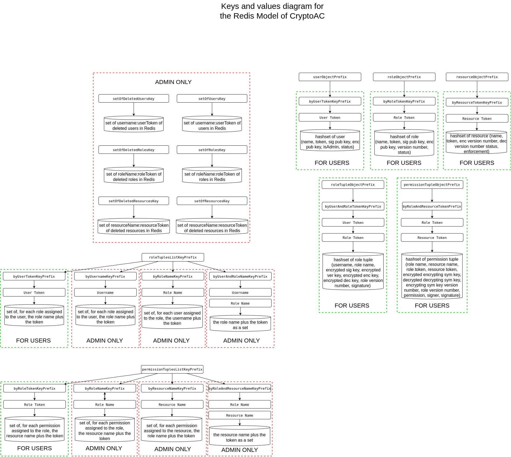

.. role:: bash(code)
   :language: bash

*****
Redis
*****

`Redis <https://redis.io/>`_ is an open source (BSD licensed) in-memory data store.

.. note::
   CryptoAC currently integrates metadata with Redis (v7.0+) for role-based acccess control only.

Role-based Access Control Integration with Redis
################################################

CryptoAC stores the metadata related to the status of the role-based cryptographic access control policy in a Redis v7.0+ data store. The administrator signs all metadata to guarantee their integrity.

We assign pseudonyms--random sequences of bytes--to users, roles and resources to hide (potentially sensitive) identifiers. Moreover, to avoid the disclosure of the whole cryptographic access control policy to the users in compliance with the **need-to-know** principle, we use Redis Access Control Lists (ACLs). However, as ACLs do not currently have support for roles, each user has to be assigned permissions on what commands she can execute and what keys she can access individually. To avoid having to assign each user to all keys she can access--possibly resulting in an explosion of the ACL size due to the number of keys in Redis--we assign each user to a small number of top-level keys which, like in a hierarchy, allow access to a large number of sub-keys when complemented with specific information (i.e., the identifiers of users, roles and resources), as shown in the graph below:

All encrypted values are converted in :bash:`base64` before being stored in the database. Finally, users' access to the database is protected by passwords.

Role-based Access Control Configuration for Redis
*************************************************

To interact with the Redis data store, CryptoAC needs to know the endpoint (i.e., the URL and the port) on which the data store is listening to connections and the client's username and password (and token, if the client is not the administrator); see the :ref:`Core Profiles <Core Profiles>` section for more details. Whenever the administrator adds a user to the policy, CryptoAC also creates the user's account in the Redis data store and generates the user's password. Intuitively, the data store should have already been configured with an account for the administrator. This can be done by, e.g., setting the :bash:`redis.conf` file--which is the file where Redis reads its configuration--as shown below (remember to change the default password):

.. code-block:: bash

    requirepass "password"
    loglevel "warning"
