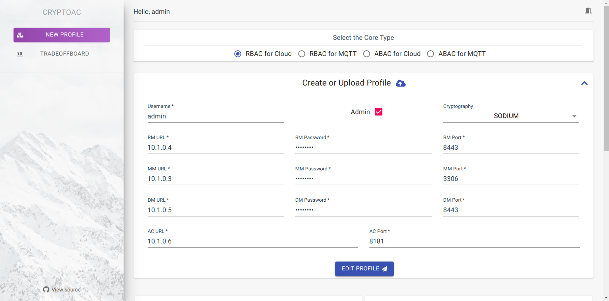

.. role:: bash(code)
   :language: bash
   
****************
CryptoAC Modules
****************

CryptoAC is designed to be highly **modular** and **easy to integrate** with other services. This is reflected into the implementation of CryptoAC that, as shown in the diagram below, is divided into self-contained modules with the goal to maximize cohesion and minimize coupling.  

Front End
#########

React Dashboard
***************

CryptoAC presents a dashboard developed in `React <https://reactjs.org/>`_ which consists in a simple UI allowing users to, e.g., create, modify and export :ref:`profiles <Core Profiles>`, check the current status of the cryptographic access control policy, interact with the :ref:`TradeOffBoard <TradeOffBoard>` and invoke :ref:`CryptoAC APIs <API Controller>` 

|login| |profile| |dashboard|

Back End
#########

API Controller
**************

CryptoAC uses `Ktor <https://ktor.io/>`_ to expose RESTful APIs returning :bash:`JSON` responses to favour flexibility, modularity, scalability and easy integration with other services. Please refer to the :ref:`OpenAPI documentation <CryptoAC APIs>` for more details on CryptoAC's APIs and the :ref:`application.conf file <Ktor Configuration>` for Ktor's configuration.

Core
****

The core is the module that specifies how to encode a policy in a given access control model (e.g., role-based access control, attribute-based access control) for enforcing a cryptographic access control policy in a particular scenario depending on the agents and entities involved (e.g., Cloud, Edge, IoT). Intuitively, the encoding of the policy is similar across cores, while the semantic of operations involving resources (i.e., add, read and write resource) may vart depending on the scenario. For instance, reading a resource when data are at rest may consist in downloading--and decrypting--a file from a simple storage service in the Cloud, while in an IoT-based scenario it may consist in subscribing to an MQTT topic. Currently, CryptoAC implements the following cores: 

.. toctree::
   :maxdepth: 1
   :glob:

   core/*/*

.. note::
   Attribute-based access control for the Cloud and MQTT is currently under development.

Core Profiles
-------------

While the access control policy is encoded through cryptography and stored in the :ref:`Metadata Manager <Metadata Manager>`, important users' information such as configuration parameters (e.g., URLs and secret credentials for accessing other modules, cryptographic parameters) and private cryptographic keys are kept inside CryptoAC; all of the information of a user comprises the **profile** of the user. A profile is essentially a :bash:`JSON` file whose structure depends on the selected :ref:`core <Core>` and deployment of CryptoAC; see below for an example:

.. code-block:: json

   {
      "type":"eu.fbk.st.cryptoac.core.CoreParametersRBAC",
      "user":{
         "name":"admin",
         "status":"OPERATIONAL",
         "isAdmin":true,
         "token":"admin"
      },
      "coreType":"RBAC_AT_REST",
      "cryptoType":"SODIUM",
      "versionNumber":1,
      "rmServiceParameters":{
         "type":"eu.fbk.st.cryptoac.rm.cryptoac.RMServiceRBACCryptoACParameters",
         "port":8443,
         "username":"admin",
         "password":"password",
         "url":"10.1.0.4",
         "rmType":"RBAC_CRYPTOAC"
      },
      "mmServiceParameters":{
         "type":"eu.fbk.st.cryptoac.mm.mysql.MMServiceRBACMySQLParameters",
         "username":"admin",
         "password":"password",
         "port":3306,
         "url":"10.1.0.3",
         "mmType":"RBAC_MYSQL"
      },
      "dmServiceParameters":{
         "type":"eu.fbk.st.cryptoac.dm.cryptoac.DMServiceCryptoACParameters",
         "port":8443,
         "username":"admin",
         "password":"password",
         "url":"10.1.0.5",
         "dmType":"CRYPTOAC"
      },
      "acServiceParameters":{
         "type":"eu.fbk.st.cryptoac.ac.opa.ACServiceRBACOPAParameters",
         "port":8181,
         "url":"10.1.0.6",
         "acType":"RBAC_OPA"
      }
   }

Users can easily export and import profiles from and into multiple instances of CryptoAC--which can serve several users at the same time--, effectively decoupling users' information from the instructions on how to enforce an access control policy through cryptography--i.e., the :ref:`cores <Core>` of CryptoAC--and the encoded policy itself--i.e., the metadata stored in the :ref:`Metadata Manager <Metadata Manager>`--.

Metadata Manager
****************
 
In cryptographic access control, the policy is encoded with the (encrypted) cryptographic secret keys and further auxiliary data (e.g., version numbers, public keys, digital signatures), together referred to as **metadata**, which need to be securely stored somewhere. Consequently, when used in both the :ref:`Master <Master Operation Mode>` and :ref:`Service <Service Operation Mode>` modes, CryptoAC stores the metadata related to the status of the cryptographic access control policy in a **Metadata Manager**--usually, a database or a similar service--. Metadata are digitally signed to provide authenticity and integrity in case of accidental or malicious modifications. The Metadata Manager can be operated by a partially trusted agent (e.g., a managed database in the Cloud) if information such as user and resource names is not deemed to be sensitive.

CryptoAC integrates with the following Metadata Manager mechanisms out-of-the-box (support for other mechanisms can easily be added, as explained in the :ref:`Extensibility <Extensibility>` section):

.. toctree::
   :maxdepth: 1
   :glob:

   mm/*/*

Data Manager
************

Cryptographic access control is all about protecting and regulating access to sensitive data. Intuitively, data are shared among a group of users and can travel through the network (i.e., in transit) or be stored in a repository (i.e., at rest). In both cases, data are usually handled by one or more **`Data Managers`**--such as simple storage services or message brokers--operated by third-parties, as explained in the :ref:`motivations <Motivation>`. Usually, the functionalities offered by a Data Manager follow the **Create, Read, Update and Delete (CRUD)** paradigm.

When used in the :ref:`Master <Master Operation Mode>` mode, CryptoAC has the ability to integrate the handling and sharing of sensitive data automatically. More in detail, CryptoAC abstracts data--which can be in the form of documents, files, communication channels and message queues--to **`resources`**, where each resource is typically associated with a unique cryptographic (symmetric) key; this key is used to guarantee the confidentiality and integrity of all data contained in the corresponding resource and it is shared with authorized users only. In other words, whenever a user wants to add or write new data to a resource, CryptoAC encrypts the data and publishes them to the specified Data Manager(s), from which other instances of CryptoAC can retrieve (and, if authorized, decrypt) them. In this way, sensitive data are always encrypted when handled by a Data Manager, and are thus protected from external attackers, malicious insiders, colluding (unauthorized) users and even from third-parties. As such, the Data Manager can be operated by partially trusted agents.

CryptoAC integrates with the following Data Managers out-of-the-box (support for other managers can easily be added, as explained in the :ref:`Extensibility <Extensibility>` section):

.. toctree::
   :maxdepth: 1
   :glob:

   dm/*/*

.. note::
   Typically, Data Managers are independent of the chosen access control model (e.g., based on roles or attributes), and can thus be used in a wide variety of scenarios. See the :ref:`Interoperability of CryptoAC Modules <Interoperability of CryptoAC Modules>` section for more details.

Reference Monitor
*****************
 
The use of cryptography alone does not prevent an unauthorized user to add spurious resources or overwrite an existing resource to compromise the integrity and the availability of the application. Therefore, when used in the :ref:`Master <Master Operation Mode>` mode, (some deployments of) CryptoAC may require the presence of a **Reference Monitor** mediating users' requests to add and (over)write resources to ensure compliance with the policy. We highlight that, being resources encrypted, the Reference Monitor cannot access sensitive data in any case. As such, the Reference Monitor can be operated by partially trusted agents.

CryptoAC integrates with the following Reference Monitor mechanisms out-of-the-box (support for other mechanisms can easily be added, as explained in the :ref:`Extensibility <Extensibility>` section):

.. toctree::
   :maxdepth: 1
   :glob:

   rm/*/*

.. note::
   Typically, Reference Monitors are independent of the chosen access control model (e.g., based on roles or attributes), and can thus be used in a wide variety of scenarios. See the :ref:`Interoperability of CryptoAC Modules <Interoperability of CryptoAC Modules>` section for more details.

Access Controller
*****************
 
Cryptographic access control is generally known to be **computationally expensive**, at least with respect to traditional mechanisms enforcing policies in a centralized fashion; this is particularly true when policies are highly dynamic and advanced cryptographic primitives--such as attribute-based encryption--are employed.

When used in the :ref:`Master <Master Operation Mode>` mode, CryptoAC has the ability to integrate and synchronize the cryptographic access control policy with one of these traditional mechanisms (which we call **`Access Controller`**) automatically. This integration allows to specify how to protect each resource--either with both cryptographic and traditional access control or with just the latter--, relieving the computational burden of cryptography according to the sensitivity and trust of involved data and users, respectively. In other words, for each resource, it is possible to decide whether to enforce access control policies through cryptography, in a centralized fashion by an Access Controller--usually operated by a trusted or partially trusted agent--or with both methods. 

CryptoAC integrates with the following Access Controller mechanisms out-of-the-box (support for other mechanisms can easily be added, as explained in the :ref:`Extensibility <Extensibility>` section):

.. toctree::
   :maxdepth: 1
   :glob:

   ac/*/*

When integrating role-based cryptographic access control, CryptoAC expects traditional Access Controller mechanisms to expose at least the 10 core operations defined in the NIST standard, :ref:`[9] <References>` i.e., add and delete users, roles and resources, and assign and revoke users and permissions to roles. In addition, a mechanism should also allow users to request access (e.g., read and write) to resources, for a total of 12 operations.

.. note::
   Integration of CryptoAC with Access Controller mechanisms for attribute-based access control policy is currently under development.

Cryptographic Provider
**********************

Intuitively, cryptographic access control involves cryptographic algorithms and primitives which are expected to be implemented by a cryptographic provider. At a high-level, CryptoAC uses both **public key cryptography**--e.g., based on public key infrastructure (PKI), attribute-based encryption--and **symmetric cryptography** to encrypt resources and regulate access through rich and expressive policies.

CryptoAC integrates with the following cryptographic providers out-of-the-box (support for other providers can easily be added, as explained in the :ref:`Extensibility <Extensibility>` section):

.. toctree::
   :maxdepth: 1
   :glob:

   crypto/*/*

Interoperability of CryptoAC Modules
####################################

Modules in CryptoAC are interoperable to a certain extent; intuitively, a database created to contain metadata about roles cannot be used with an attribute-based access control policy. Below, we report the **interoperability between the cores and the other modules of CryptoAC**. The "✓" symbol represents an already established (i.e., implemented) interoperability, while the "p" symbol represents a partial interoperability (i.e., not all required functionalities required by the core are supported by the module) and the "o" symbol represents an on-going interface development. Finally, the "✗" symbol represents an incompatibility between the corresponding core and module. 

+--------+---------------------------+----------+------+----------+------+
|        |                           |               Core                |
+        +                           +-----------------+-----------------+
| Module | Available Implementations |       RBAC      |        ABAC     |
+        +                           +----------+------+----------+------+
|        |                           | CryptoAC | MQTT | CryptoAC | MQTT |
+========+===========================+==========+======+==========+======+
|        |             MySQL         |    ✓     |   ✓  |     ✓    |   ✓  |
+   MM   +---------------------------+----------+------+----------+------+
|        |             Redis         |    ✓     |   ✓  |     o    |   o  |
+--------+---------------------------+----------+------+----------+------+
|        |             CryptoAC      |    ✓     |   ✗  |     ✓    |   ✗  |
+   DM   +---------------------------+----------+------+----------+------+
|        |             MQTT          |    ✗     |   ✓  |     ✗    |   o  |
+--------+---------------------------+----------+------+----------+------+
|        |             OPA           |    ✓     |   ✗  |     o    |   ✗  |
+        +---------------------------+----------+------+----------+------+
|   AC   |             XACML         |    ✓     |   ✗  |     o    |   ✗  |
+        +---------------------------+----------+------+----------+------+
|        |             DynSec        |    ✗     |   ✓  |     ✗    |   ✗  |
+--------+---------------------------+----------+------+----------+------+
|   RM   |             CryptoAC      |    ✓     |   ✗  |     ✗    |   ✗  |
+--------+---------------------------+----------+------+----------+------+
|        |             Java          |    ✓     |   ✓  |     p    |   p  |
+        +---------------------------+----------+------+----------+------+
| Crypto |             Sodium        |    ✓     |   ✓  |     p    |   p  |
+        +---------------------------+----------+------+----------+------+
|        |             OpenABE       |    ✓     |   ✓  |     ✓    |   ✓  |
+--------+---------------------------+----------+------+----------+------+

Management of Cryptographic Material
####################################

.. warning::
   This section is under construction.

Extensibility
#############

.. warning::
   This section is under construction.

.. 
   here talk about how it is possible to extend cryptoac by adding modules for the cores
   - modules should have lock/unlock/rollback functions (Lockable interface | explain)
   - modules should have configure/alreadyConfigured/init/deinit functions (Service interface | explain)

